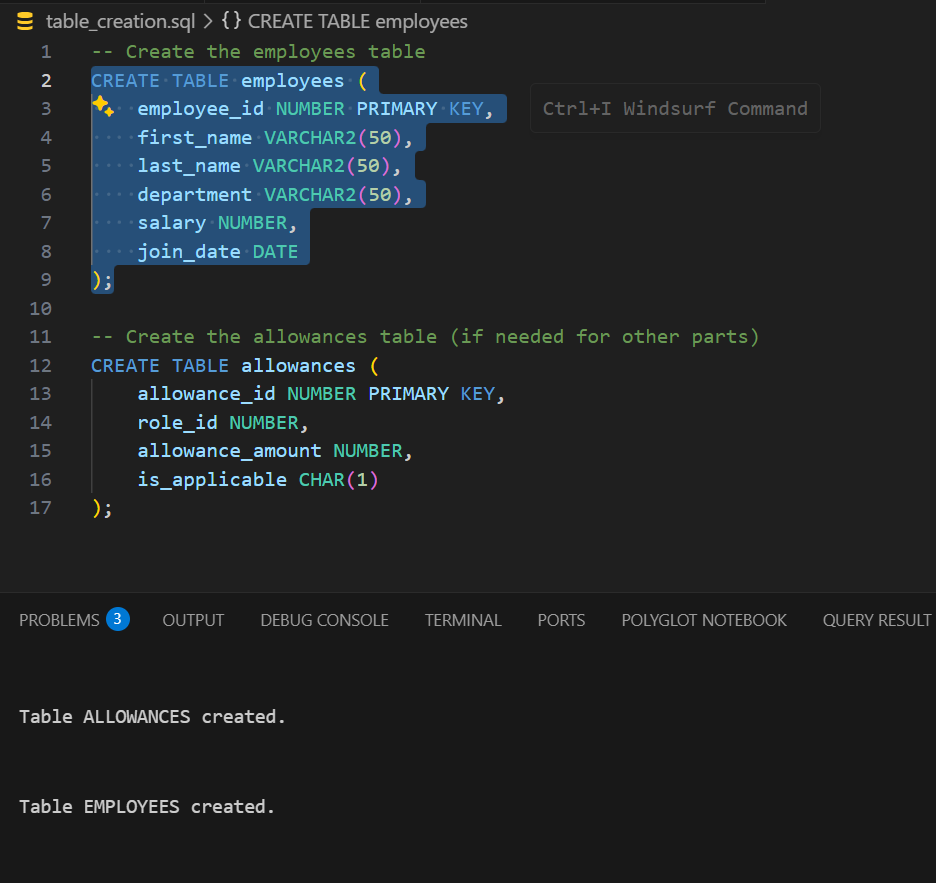
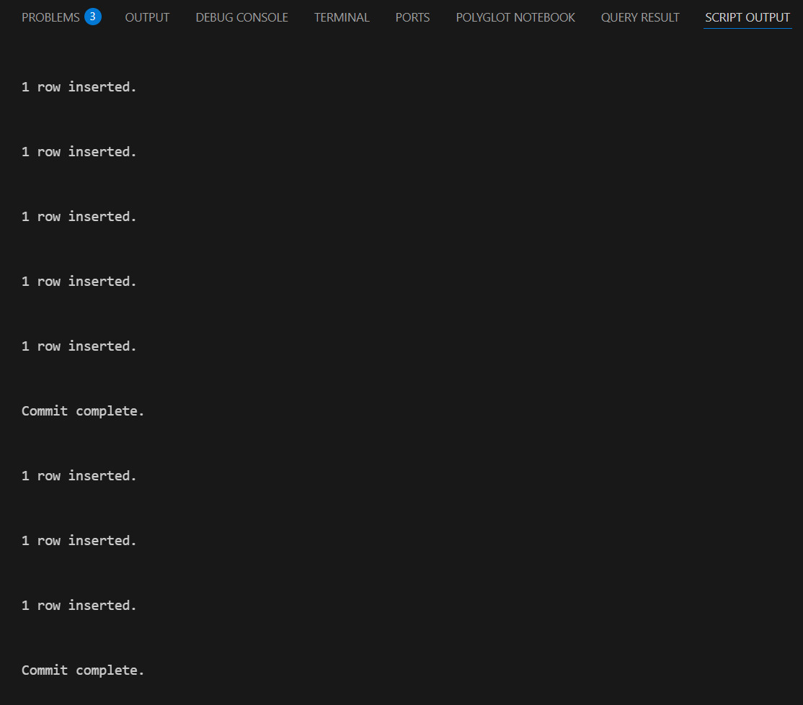
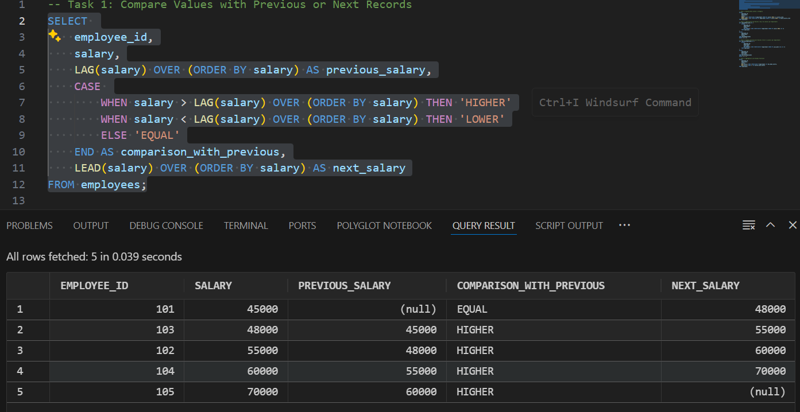
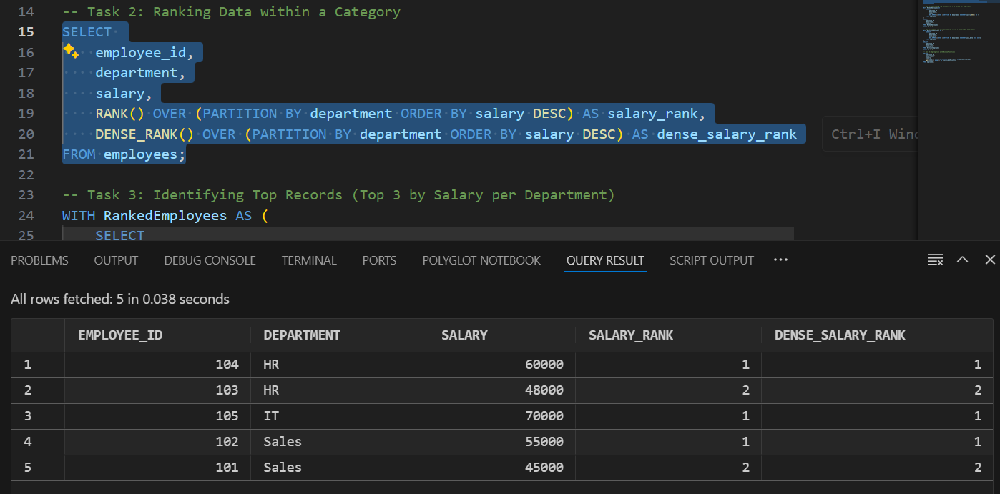
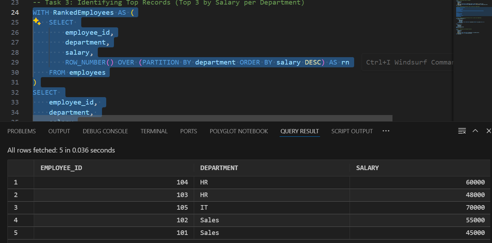
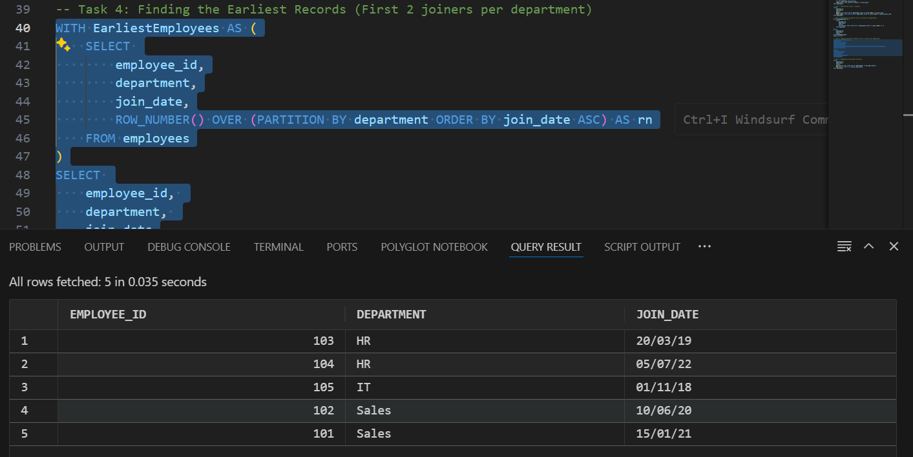
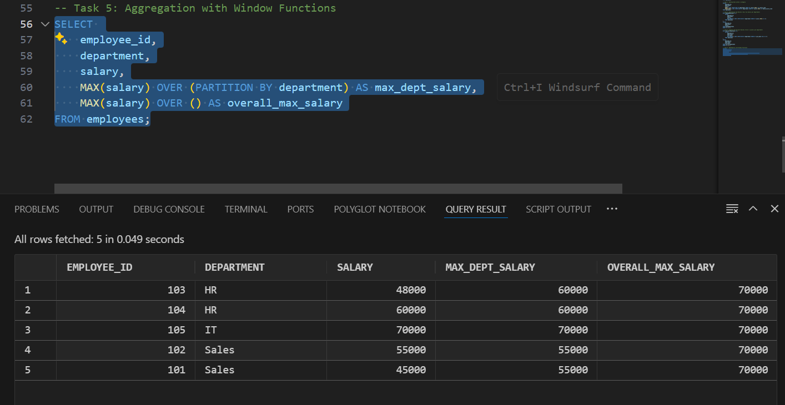

# SQL Window Functions Assignment

**Group Name:** Committed_to_query  
**Team Members:**  [Pacifique bakundukize  26798] & [Isange Nelly 27818]
**Instructor:** Eric Maniraguha

## Overview

This repository contains all SQL scripts for the assignment on SQL Window Functions.
 The assignment includes table creation, data insertion, and queries that utilize
 various window functions such as LAG(), LEAD(), RANK(), DENSE_RANK(), ROW_NUMBER(),
 and aggregate functions with PARTITION BY.

## Files Description

- **table_creation.sql:**  
  Contains SQL code to create the necessary tables ( `employees` and `allowances`).

- **data_insertion.sql:**  
  Provides sample data insertion into the created tables. This data supports the execution
   of window function queries.

- **window_functions_queries.sql:**  
  Includes all SQL queries for the five tasks as specified in the assignment:
  1. **Comparing Values:** Uses LAG() and LEAD() to compare salary values with previous
  and next records.
  2. **Ranking Data:** Uses RANK() and DENSE_RANK() to rank employees by salary within
   each department.
  3. **Identifying Top Records:** Fetches the top 3 salaries per department using ROW_NUMBER().
  4. **Finding the Earliest Records:** Retrieves the first two join dates per department.
  5. **Aggregation with Window Functions:** Calculates the maximum salary per department
  and overall maximum salary.

## Explanation of Queries

### Task 1: Compare Values with Previous or Next Records

- **Query Logic:**  
  The query uses `LAG(salary)` to get the previous record’s salary and compares it with
   the current row using a CASE statement. Similarly, `LEAD(salary)` is used to fetch
   the next salary value.
- **Query Result:**

- **Real-life Application:**  
  Useful for analyzing trends such as incremental changes in salaries or sales figures over time.

### Task 2: Ranking Data within a Category

- **Query Logic:**  
  Ranks employees within each department based on salary in descending order
  using `RANK()` and `DENSE_RANK()`.
- **Difference Between RANK() and DENSE_RANK():**  
  - **RANK():** Leaves gaps in rank numbers when there are ties.
  - **DENSE_RANK():** Does not leave gaps; consecutive ranking.
- **Query Result:**

- **Real-life Application:**  
  Essential for performance evaluations and bonus distribution analysis.

### Task 3: Identifying Top Records

- **Query Logic:**  
  Uses a Common Table Expression (CTE) with `ROW_NUMBER()` to assign a unique rank to each
   employee within their department, filtering the top three per department.
- **Query Result:**

- **Real-life Application:**  
  Identifies top performers, such as highest-paid employees or best-selling products.

### Task 4: Finding the Earliest Records

- **Query Logic:**  
  Uses `ROW_NUMBER()` to order employees by join date within each department, selecting
  the first two records.
- **Query Result:**

- **Real-life Application:**  
  Useful for recognizing long-tenured employees or early adopters.

### Task 5: Aggregation with Window Functions

- **Query Logic:**  
  Computes the maximum salary within each department and the overall maximum salary across
  all records using `MAX()` with and without PARTITION BY.
- **Query Result:**

- **Real-life Application:**  
  Helpful in budget analysis and setting salary benchmarks across departments.

## GitHub Collaboration

- We have both contributed to this repository.  
- Instructor **ericmaniraguha** is added as a collaborator for assessment.
